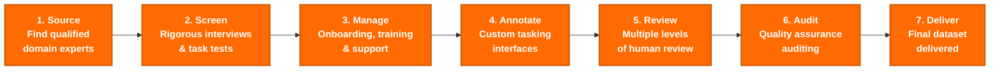

# Human Data @ MangoDesk

---

## We are uncompromising on Quality.

- All of our contributors are domain experts who are [rigorously interviewed and task‑tested](https://www.mangodesk.com/) before they contribute to your dataset. The level of rigor in our screening process matches that of full interview loops at elite companies.
- We take a high-touch approach to managing our pipelines. We obsess over detail, from the contributor selection to the task interface, pipeline design, and automated quality checks, to maintain our high bar for quality.
- Our contributor screening and labeling infrastructure layers proprietary technology on top of industry best practices to deliver on contributor and data quality at scale.

---

## Use Cases

<aside>
**RLVR**

</aside>

<aside>
**RLHF**

</aside>

<aside>
**Evals**

</aside>

<aside>
**SFT**

</aside>

## Our offerings

1. **Data** **and Evals** – Hand us your specifications and receive your data. Let us handle every aspect of your dataset creation. Our flexible annotation platform supports highly customized use cases, with robust systems in place to ensure quality.
2. **Managed Workforce** – Leverage our experts with your in-house labelling platform. We manage sourcing, screening, onboarding, and off-boarding.

## Our Process

<aside>
**1. Source**
We find the most qualified domain experts

</aside>

<aside>
**2. Screen**
Experts are screened through rigorous interview loops and task-based tests

</aside>

<aside>
**3. Manage**
On-boarding/off-boarding, training, support, performance management

</aside>

<aside>
**4. Annotate**
Our experts perform annotation tasks on custom tasking interfaces

</aside>

<aside>
**5. Review**
Every task goes through multiple levels of human review

</aside>

<aside>
**6. Audit**
Every deliverable is audited to ensure quality

</aside>

<aside>
**7. Deliver**
Final dataset delivered to you

</aside>

---

Contact us: [humandata@mangodesk.com](mailto:humandata@mangodesk.com)

Backed by Y Combinator
